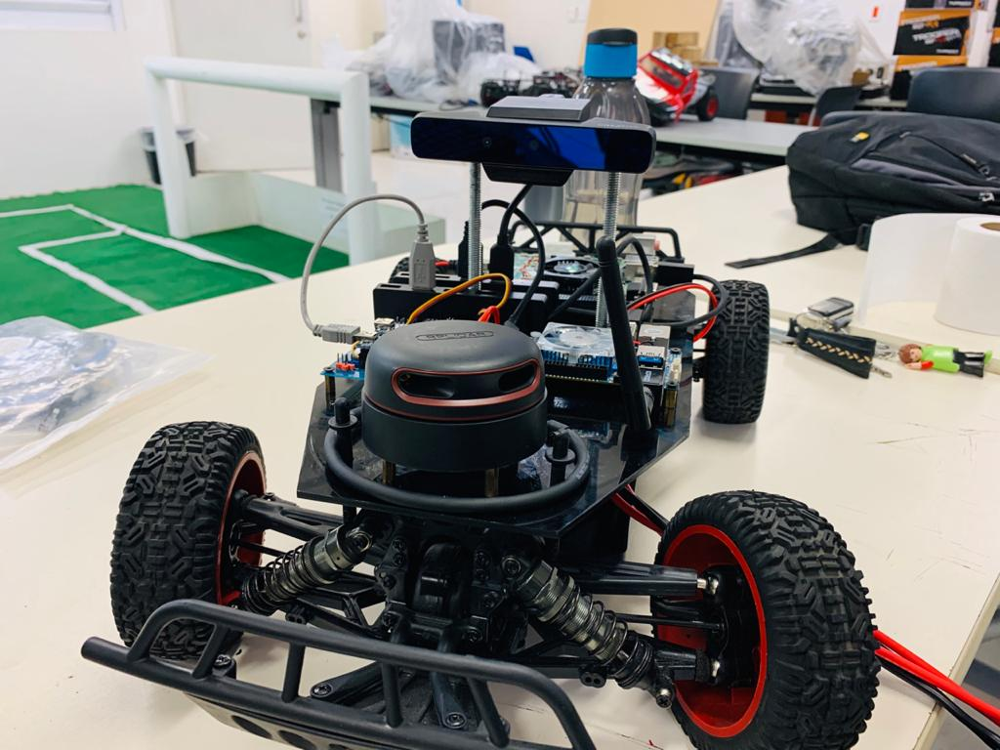
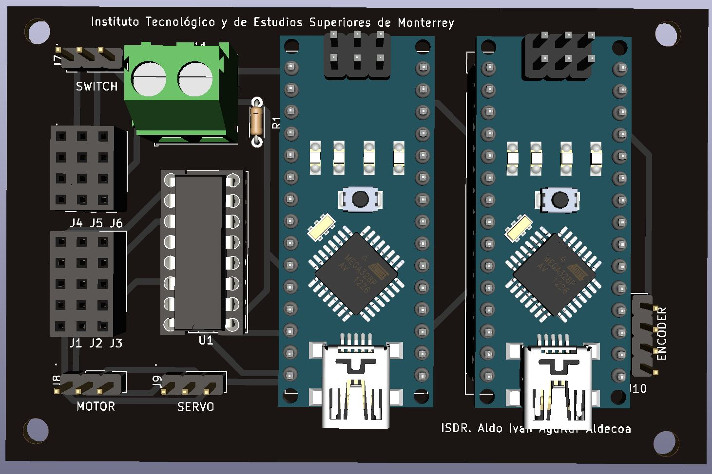

# Self Driving Car Project
This repository is dedicated to the development of a robotic system capable of performing an autonomous driving behavior of a 1/10 RC Vehicle using Control algorithms based in Deep Neural Networks through ROS.

  

## Table of Contents

* [Project Description](#project-description)

* [Installation](#installation)

  - [Hardware prerequisites](#hardware-prerequisites)

  - [Software prerequisites](#software-prerequisites)

  - [Hardware setup](#hardware-setup)
  
    + [Electric connections](#electric-connections)

## Project Description
The objective of this project is to develop an autonomous driving robotic system using a 1/10 RC Vehicle which is instrumented using specific hardware to control and measure its velocity and direction through ROS. As mentioned, a Deep Neural Network is used to Control the autonomous behavior of the vehicle which is trained and tested using the information of the vehicle's direction and speed data as well as visual and spatial information provided by an RGB/Depth camera and a Lidar sensor mounted in the vehicle.

## Installation
The following steps are aimed to help the user replicate the setting up of the project at its current state, as well as giving an overall understanding of the implemented system.

| NOTE: This tutorial serves as a guide to setup the project to run with the listed hardware and softwares specifications however it is recommended that any new contributor makes the effort of migrating the current state of the project to the newest software and hardware requisites as it will guarantee a longer support and the potential implementation of newer packages that might help push the project forward in the future.  |
| --- |

### Hardware Prerequisites
* [Turnigy Trooper SCT-X4 1/10 4x4 Nitro Course Truck](https://hobbyking.com/es_es/turnigy-trooper-sct-x4-1-10-4x4-nitro-short-course-truck-rtr.html) [[1](#references)]
* [7.4V 2S LiPo battery with XT60 Connector](https://hobbyking.com/es_es/turnigy-2200mah-2s-30c-lipo-pack.html?queryID=61017de534bd628a334581b6a7d83735&objectID=18290&indexName=hbk_live_magento_es_es_products)
* [Matek PDB-XT60 (Power Distribution Board)](https://articulo.mercadolibre.com.mx/MLM-612335416-placa-de-distribucion-poder-pdb-drone-ubec-12v-y-5v-drone-_JM?quantity=1) [[2](#references)]
* [XI4005 Step Down Voltage Regulator](https://articulo.mercadolibre.com.mx/MLM-714620453-modulo-step-down-regulador-xl4005-5-32v-a-125-32v-5a-75w-_JM)
* [6 pins ON/OFF Switch](https://articulo.mercadolibre.com.mx/MLM-677740634-switch-interruptor-balancin-con-piloto-on-off-6-patas-2p-2t-_JM?quantity=1#position=5&type=item&tracking_id=82bb2446-1a24-42d8-a4a6-f555bc81b157)
* [12 AWG Silicon Cable](https://articulo.mercadolibre.com.mx/MLM-705048819-cable-12-awg-silicon-suave-drone-2mt-rojo-negro-bateria-lipo-_JM?quantity=1)
* [16 AWG Silicon Cable](https://articulo.mercadolibre.com.mx/MLM-599509724-cable-16-awg-silicon-60cm-30cm-negro-30-rojo-dron-robotica-_JM)
* [XT60 2 Female 1 Male Parallel Adapter (Y Connector)](https://www.amazon.com.mx/gp/product/B07W99CWS9/ref=ppx_yo_dt_b_asin_title_o05_s00?ie=UTF8&psc=1)
* [HXT 4mm to XT60 Male Adapter](https://www.amazon.com/Pack-XT60-Male-Conversion-Adapters/dp/B072BQBH92)
* [XT60 Male and Female Connectors](https://www.amazon.com.mx/gp/product/B01CQ2ON6Q/ref=ppx_yo_dt_b_asin_title_o00_s00?ie=UTF8&psc=1)
* [5.5mm Jack Male Connector](https://articulo.mercadolibre.com.mx/MLM-698487860-conector-jack-de-voltaje-macho-o-hembra-cable-55mm-21mm-_JM?quantity=1&variation=40282986743#position=4&type=item&tracking_id=72f44a5c-2100-46d6-a7ed-027b24ecf050)
* [Turnigy 9X 9Ch Mode 2 Transmitter and Receiver](https://hobbyking.com/es_es/turnigy-9x-9ch-mode-2-transmitter-w-module-ia8-receiver-afhds-2a-system.html) [[3](#references)]
* [Turnigy RC ON/OFF Switch](https://hobbyking.com/es_es/turnigy-receiver-controlled-switch-1.html) [[4](#references)]
* [Rotative Incremental Encoder](https://articulo.mercadolibre.com.mx/MLM-711576184-encoder-rotativo-incremental-para-calcular-distancia-y-velocidad-_JM)
* [Anker USB 3.0 Hub 0.7ft](https://www.anker.com/es/products/variant/4port-usb-30-ultra-slim-data-hub/A7516011)
* [Startech 15cm USB A to Mini B Cable](https://www.amazon.com.mx/gp/product/B003WV5DME/ref=ppx_yo_dt_b_asin_title_o01_s00?ie=UTF8&th=1)
* [Startech 15cm USB A to Micro B Cable](https://www.amazon.com.mx/gp/product/B00NTR1D8E/ref=ppx_yo_dt_b_asin_title_o02_s00?ie=UTF8&psc=1)
* [Wi-Fi USB Adapter](https://www.steren.com.mx/adaptador-usb-wi-fi.html)
* [Odroid XU4](https://wiki.odroid.com/odroid-xu4/odroid-xu4) [[5](#references)]
* [Intel Realsense SR300 / BlasterX Senz3D camera](https://es.creative.com/p/web-cameras/blasterx-senz3d) [[6](#references)]
* [RPLidar Laser Range Scanner A2](https://www.slamtec.com/en/Lidar/A2) [[7](#references)]
* [Configurable Network Router with Internet Access](https://www.linksys.com/es/p/P-WRT54GL/#product-features) [[8](#references)]
* Ethernet Cable
* External PC
* [Direction and Spped Control PCB](pc/kicad)
* [Arduino Nano](https://store.arduino.cc/usa/arduino-nano)

### Software prerequisites
* Ubuntu MATE 18.04 Operating System installed in the Odroid XU4 Board, installation guide can be found [here](https://wiki.odroid.com/odroid-xu4/getting_started/os_installation_guide#tab__odroid-xu4).
* Ubuntu 18.04 Operating System installed in the External PC.
  - Download the ISO file from [this link](http://releases.ubuntu.com/bionic/) by selecting the `64-bit PC (AMD64) desktop image`.
  - Create a bootable USB image of the ISO file. That process is explained in these links for [Windows](https://tutorials.ubuntu.com/tutorial/tutorial-create-a-usb-stick-on-windows#0) and [MacOS](https://tutorials.ubuntu.com/tutorial/tutorial-create-a-usb-stick-on-macos#0).
  - Installation process for Ubuntu 18.04 Operating System ca be found in [this tutorial](https://ubuntu.com/tutorials/tutorial-install-ubuntu-desktop#1-overview). *( Although a virtual machine with Ubuntu can be used in the external PC, it is recommended that Ubuntu runs natively in both computers. A recommended alternative to using a VM is [installing Ubuntu in a disk partition and using dual boot](https://www.tecmint.com/install-ubuntu-alongside-with-windows-dual-boot/) )*.

### Hardware setup
#### Electric connections

Setting up the electric connections is pretty straightforward, if working with an already mounted car it is recommended to check for any short circuit or damaged cable before connecting the battery or turning on the system. Remember to measure the output voltage of  the regulators before connecting any of the controller boards, guaranteeing an output voltage of around **5.25V**, and always validate that the LiPo battery is charged and balanced before running the system.

| NOTE: For more information regarding the implemented PCB mounting or for further updates and modifications go [here](pc/kicad). |
| --- |

  

| NOTE: If mounting a new system, consider using the hardware mentioned in the [hardware prerequisites](#hardware-prerequisites) section, it will be necessary to solder different elements of the system such as the ON/OFF Switch XT60 Connectors, the PDB XT60 Connectors and the Voltage Regulators input and output cables as well as the required components for the montage of the PCB. |
| --- |

  

#### Hardware Mounting

## References
1. Turnigy. (2016). *Trooper SCT-X4 User Manual*. Retrieved from: [https://hobbyking.com/es_es/turnigy-trooper-sct-x4-1-10-4x4-nitro-short-course-truck-rtr.html](doc/datasheets/SCT-X4_Manual.pdf)
2. Matek. (2020). *PDB-XT60 User Manual*. Retrieved from: [http://www.mateksys.com/?portfolio=pdb-xt60#tab-id-3](doc/datasheets/PDB-XT60_Manual.pdf)
3. Turnigy. (2016). *Turnigy 9x 2.4GHz radio TGY User Manual*. Retrieved from: [https://hobbyking.com/media/file/725056143X2037269X20.pdf](doc/datasheets/TGY-9x-9CH_Manual.pdf)
4. Turnigy. (2016). *Turnigy R/C Electronic Switch Manual*. Retrieved from: [https://cdn-global-hk.hobbyking.com/media/file/t/u/turnigy_rc_switch_manual.pdf](doc/datasheets/RC-Switch_Manual.pdf)
5. Odroid XU4. (2017). *Odroid XU4 User Manual*. Retrieved from: [https://magazine.odroid.com/wp-content/uploads/odroid-xu4-user-manual.pdf](doc/datasheets/Odroid-XU4_Manual.pdf)
6. Intel Corporation. (2016). *Intel RealSense Camera SR300*. Retrieved from: [https://www.mouser.com/pdfdocs/intel_realsense_camera_sr300.pdf](datasheets/RealSenseCamera-SR300_Manual.pdf)
7. Slamtec. (2016). *RPLidar A2 User Manual*. Retrieved from: [https://www.generationrobots.com/media/robopeak_2d_lidar_brief_en_A2M4.pdf](doc/datasheets/RPLidar-A2_Manual.pdf)
8. Linksys. (2016). *Linksys Wireless-G WRT54GL Manual*. Retrieved from: [https://downloads.linksys.com/downloads/userguide/1224639055327/WRT54Gv7-EU_UG.pdf](doc/datasheets/WRT54GL_Manual.pdf)
