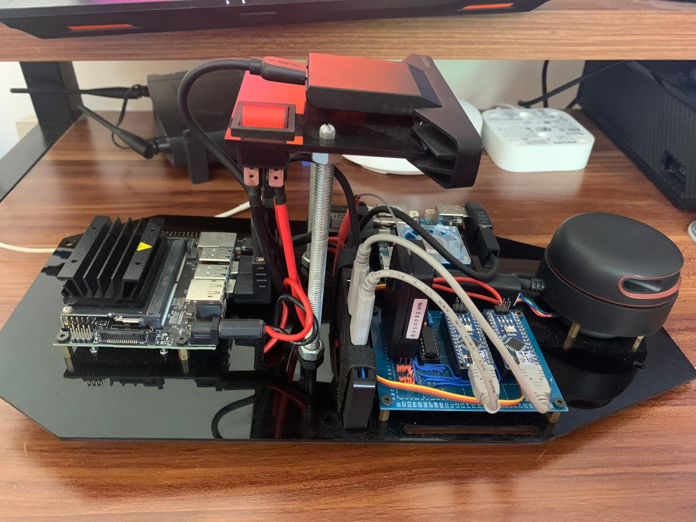
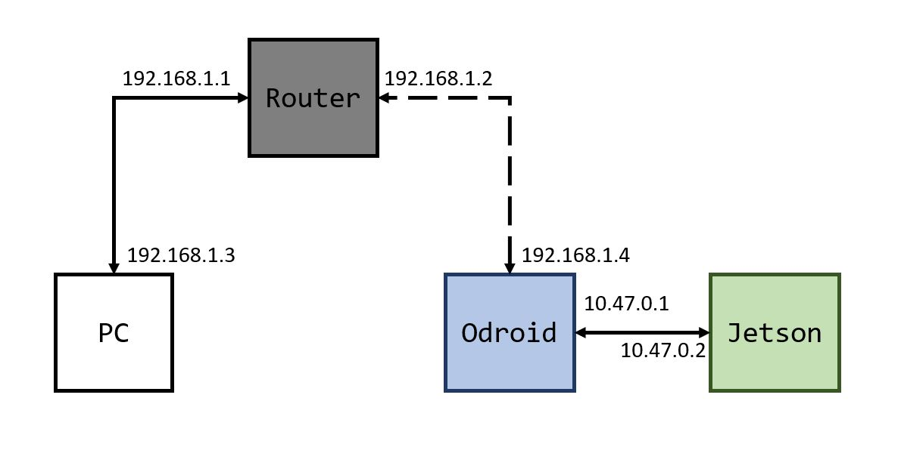
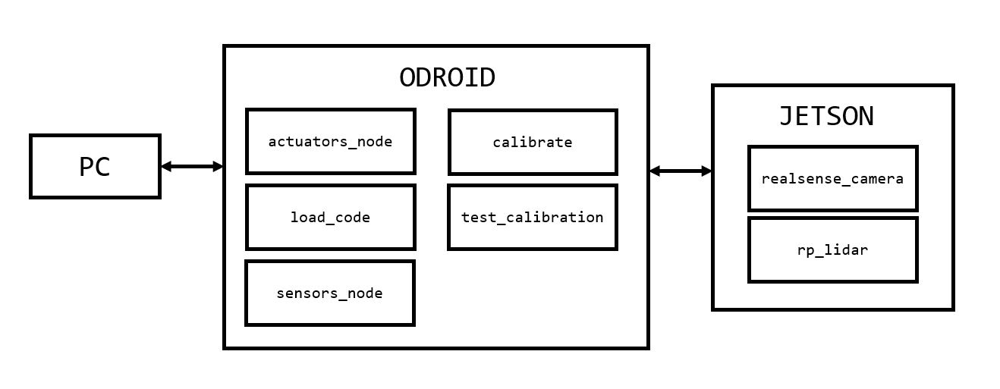

# Self Driving Car Project
This repository is dedicated to the development of a robotic system capable of performing an autonomous driving behavior of a 1/10 RC Vehicle using Control algorithms based in Deep Neural Networks through ROS.

<p align="center">
  
</p>

## Table of Contents

* [Project Description](#project-description)
* [Installation](#installation)
  - [Hardware prerequisites](#hardware-prerequisites)
  - [Software prerequisites](#software-prerequisites)
  - [Hardware setup](#hardware-setup)
  - [Software setup](#software-setup)
  - [Network setup](#network-setup)
* [ROS Architecure](#ros-architecture)

## Project Description
The objective of this project is to develop an autonomous driving robotic system using a 1/10 RC Vehicle which is instrumented using specific hardware to control and measure its velocity and direction through ROS. As mentioned, a Deep Neural Network is used to Control the autonomous behavior of the vehicle which is trained and tested using the information of the vehicle's direction and speed data as well as visual and spatial information provided by an RGB/Depth camera and a Lidar sensor mounted in the vehicle.

## Installation
The following steps are aimed to help the user replicate the setting up of the project at its current state, as well as giving an overall understanding of the implemented system.

| NOTE: This tutorial serves as a guide to setup the project to run with the listed hardware and softwares specifications however it is recommended that any new contributor makes the effort of migrating the current state of the project to the newest software and hardware requisites as it will guarantee a longer support and the potential implementation of newer packages that might help push the project forward in the future.  |
| --- |

### Hardware Prerequisites
* [Turnigy Trooper SCT-X4 1/10 4x4 Nitro Course Truck](https://hobbyking.com/es_es/turnigy-trooper-sct-x4-1-10-4x4-nitro-short-course-truck-rtr.html) [[1](#references)]
* [7.4V 2S LiPo battery with XT60 Connector](https://hobbyking.com/es_es/turnigy-2200mah-2s-30c-lipo-pack.html?queryID=61017de534bd628a334581b6a7d83735&objectID=18290&indexName=hbk_live_magento_es_es_products)
* [Matek PDB-XT60 (Power Distribution Board)](https://articulo.mercadolibre.com.mx/MLM-612335416-placa-de-distribucion-poder-pdb-drone-ubec-12v-y-5v-drone-_JM?quantity=1) [[2](#references)]
* [XI4005 Step Down Voltage Regulator](https://articulo.mercadolibre.com.mx/MLM-714620453-modulo-step-down-regulador-xl4005-5-32v-a-125-32v-5a-75w-_JM)
* [6 pins ON/OFF Switch](https://articulo.mercadolibre.com.mx/MLM-677740634-switch-interruptor-balancin-con-piloto-on-off-6-patas-2p-2t-_JM?quantity=1#position=5&type=item&tracking_id=82bb2446-1a24-42d8-a4a6-f555bc81b157)
* [12 AWG Silicon Cable](https://articulo.mercadolibre.com.mx/MLM-705048819-cable-12-awg-silicon-suave-drone-2mt-rojo-negro-bateria-lipo-_JM?quantity=1)
* [16 AWG Silicon Cable](https://articulo.mercadolibre.com.mx/MLM-599509724-cable-16-awg-silicon-60cm-30cm-negro-30-rojo-dron-robotica-_JM)
* [XT60 2 Female 1 Male Parallel Adapter (Y Connector)](https://www.amazon.com.mx/gp/product/B07W99CWS9/ref=ppx_yo_dt_b_asin_title_o05_s00?ie=UTF8&psc=1)
* [HXT 4mm to XT60 Male Adapter](https://www.amazon.com/Pack-XT60-Male-Conversion-Adapters/dp/B072BQBH92)
* [XT60 Male and Female Connectors](https://www.amazon.com.mx/gp/product/B01CQ2ON6Q/ref=ppx_yo_dt_b_asin_title_o00_s00?ie=UTF8&psc=1)
* [5.5mm Jack Male Connector](https://articulo.mercadolibre.com.mx/MLM-698487860-conector-jack-de-voltaje-macho-o-hembra-cable-55mm-21mm-_JM?quantity=1&variation=40282986743#position=4&type=item&tracking_id=72f44a5c-2100-46d6-a7ed-027b24ecf050)
* [Turnigy 9X 9Ch Mode 2 Transmitter and Receiver](https://hobbyking.com/es_es/turnigy-9x-9ch-mode-2-transmitter-w-module-ia8-receiver-afhds-2a-system.html) [[3](#references)]
* [Turnigy RC ON/OFF Switch](https://hobbyking.com/es_es/turnigy-receiver-controlled-switch-1.html) [[4](#references)]
* [Rotative Incremental Encoder](https://articulo.mercadolibre.com.mx/MLM-711576184-encoder-rotativo-incremental-para-calcular-distancia-y-velocidad-_JM)
* [Anker USB 3.0 Hub 0.7ft](https://www.anker.com/es/products/variant/4port-usb-30-ultra-slim-data-hub/A7516011)
* [Startech 15cm USB A to Mini B Cable](https://www.amazon.com.mx/gp/product/B003WV5DME/ref=ppx_yo_dt_b_asin_title_o01_s00?ie=UTF8&th=1)
* [Startech 15cm USB A to Micro B Cable](https://www.amazon.com.mx/gp/product/B00NTR1D8E/ref=ppx_yo_dt_b_asin_title_o02_s00?ie=UTF8&psc=1)
* [Wi-Fi USB Adapter](https://www.steren.com.mx/adaptador-usb-wi-fi.html)
* [Odroid XU4](https://wiki.odroid.com/odroid-xu4/odroid-xu4) [[5](#references)]
* [Intel Realsense SR300 / BlasterX Senz3D camera](https://es.creative.com/p/web-cameras/blasterx-senz3d) [[6](#references)]
* [RPLidar Laser Range Scanner A2](https://www.slamtec.com/en/Lidar/A2) [[7](#references)]
* [Configurable Network Router with Internet Access](https://www.linksys.com/es/p/P-WRT54GL/#product-features) [[8](#references)]
* Ethernet Cable
* External PC
* [Direction and Spped Control PCB](pc/kicad)
* [Arduino Nano](https://store.arduino.cc/usa/arduino-nano)

### Software prerequisites
* Ubuntu MATE 18.04 Operating System installed in the Odroid XU4 Board, installation guide can be found [here](https://wiki.odroid.com/odroid-xu4/getting_started/os_installation_guide#tab__odroid-xu4).
* Ubuntu 18.04 Operating System installed in the External PC.
  - Download the ISO file from [this link](http://releases.ubuntu.com/bionic/) by selecting the `64-bit PC (AMD64) desktop image`.
  - Create a bootable USB image of the ISO file. That process is explained in these links for [Windows](https://tutorials.ubuntu.com/tutorial/tutorial-create-a-usb-stick-on-windows#0) and [MacOS](https://tutorials.ubuntu.com/tutorial/tutorial-create-a-usb-stick-on-macos#0).
  - Installation process for Ubuntu 18.04 Operating System ca be found in [this tutorial](https://ubuntu.com/tutorials/tutorial-install-ubuntu-desktop#1-overview). *( Although a virtual machine with Ubuntu can be used in the external PC, it is recommended that Ubuntu runs natively in both computers. A recommended alternative to using a VM is [installing Ubuntu in a disk partition and using dual boot](https://www.tecmint.com/install-ubuntu-alongside-with-windows-dual-boot/) )*.

### Hardware setup
#### Electric connections

Setting up the electric connections is pretty straightforward, if working with an already mounted car it is recommended to check for any short circuit or damaged cable before connecting the battery or turning on the system. Remember to measure the output voltage of  the regulators before connecting any of the controller boards, guaranteeing an output voltage of around **5.25V**, and always validate that the LiPo battery is charged and balanced before running the system.

| NOTE: For more information regarding the implemented PCB mounting or for further updates and modifications go [here](pc/kicad). |
| --- |

<p align="center">
  
</p>

| NOTE: If mounting a new system, consider using the hardware mentioned in the [hardware prerequisites](#hardware-prerequisites) section, it will be necessary to solder different elements of the system such as the ON/OFF Switch XT60 Connectors, the PDB XT60 Connectors and the Voltage Regulators input and output cables as well as the required components for the montage of the PCB. |
| --- |

<p align="center">
  
</p>

#### Hardware montage
The montage of the different hardware components requires to manufacture certain elements such as two acrylic plates and a pair of support posts. This will function as the base for the hardware montage where each component is screwed with a corresponding spacer.

| NOTE: For more information regarding the implemented hardware montage or for further updates and modifications go [here](pc/freecad). |
| --- |

<p align="center">
  
</p>

### Software setup
#### ODROID XU4

* Username: odroid
* Password: odroid


##### Clone GitHub repository
In a terminal, run the next command in your Home directory:
```
git clone http://github.com/AldoAguilar/self_driving_car_project
```
Add the project `setup.bash` file to your bash session so that it is sourced every time a new shell is launched:
```
echo "source ~/self_driving_car_project/odroid/catkin_ws/devel/setup.bash" >> ~/.bashrc
source ~/.bashrc
```

##### Configure Auto-Login
Run the following commands in terminal:
```
sudo su
cd /usr/share/lightdm/lightdm.conf.d
touch 60-lightdm-gtk-greeter.Configurenano 60-lightdm-gtk-greeter.conf
```
If the file isn't blank, add these to the end of the file. If the file is blank, add these lines to the file:

```
[SeatDefaults]
greeter-session=lightdm-gtk-greeter
autologin-user=odroid
```
Files in this directory are processed in alphabetical order.

The next time you reboot, the user specified after `autologin-user=` should be logged in automatically.
##### Installing ROS
Once Ubuntu MATE 18.04 has been installed in the board, it's necessary to install the ROS Melodic distribution. This section is based on the more in-depth tutorial from the ROS Wiki: [Ubuntu install of ROS Melodic](http://wiki.ros.org/melodic/Installation/Ubuntu). For a more detailed explanation please read the provided link.  

Setup your computer to accept software from packages.ros.org.

```
sudo sh -c 'echo "deb http://packages.ros.org/ros/ubuntu $(lsb_release -sc) main" > /etc/apt/sources.list.d/ros-latest.list'
```

Setup the keys:

```
sudo apt-key adv --keyserver 'hkp://keyserver.ubuntu.com:80' --recv-key C1CF6E31E6BADE8868B172B4F42ED6FBAB17C654
```

Make sure your package index is up-to-date:

```
sudo apt-get update
```

Perform a ROS Melodic full installation:
```
sudo apt-get install ros-melodic-desktop-full
```

Initialize rosdep:
```
sudo rosdep init
rosdep update
```
Setup your ROS environment variables to be automatically added to your bash session every time a new shell is launched:
```
echo "source /opt/ros/melodic/setup.bash" >> ~/.bashrc
source ~/.bashrc
```
Install other dependencies for building ROS packages:
```
sudo apt install python-rosinstall python-rosinstall-generator python-wstool build-essential
```

##### Arduino CLI Configuration
Go to the Odroid's Arduino Src Directory in `~/self_driving_car_project/odroid/src/arduino`.
It will be necessary to update the local cache of available platforms and libraries of the [arduino-cli](https://github.com/arduino/arduino-cli) tool, run the next command in terminal:

```
./arduino-cli core update-index
```

Install the core for Arduino Nano boards, run the next command in terminal:
```
./arduino-cli core install arduino:avr
```

#### JETSON NANO

The Jetson Nano will be responsible of managing the video, data management and Machine Learning algorithms. It wil be then necessary to install the required resources.

##### Clone GitHub repository
In a terminal, run the next command in your Home directory:
```
git clone http://github.com/AldoAguilar/self_driving_car_project
```

##### Install RealSense
The project depends on the utilization of the Intel Realsense Depth Camera SR300 which requires to install the Intel Realsense Libraries and drivers. The installation process can be different depending on the platform where the device is going to be used, however for total compatibility and support of this device it's recommended to make a native installation by compiling the resource code of the mentioned drivers.

The Jetson Nano as well as many other development platforms comes with a predefined Kernel with support for specific type of devices however it's possible to allow different devices by recompiling the boards kernel and enabling the required resources to allow the support for the mentioned devices. The Intel Realsense Cameras require specific Kernel patches for it to be natively compiled. For more information you can visit [this](https://github.com/JetsonHacksNano/installLibrealsense/tree/vL4T32.2.1) GitHub repository used as a basis for the installation scripts defined in this project.

To path the Jetson Nano's kernel for Intel Realsense Cameras support, go to the `realsense` directory and execute the command:
```
sudo ./pathcKernel.sh
```
This script will automatically install all the required resources for the kernel patch and recompile the loaded kernel, it's a long process that may take several minutes. Once it has concluded you will have to reboot your board in order to proceed with the Librealsense Libraries and Drivers.

Once the Kernel patch has been successfully achieved, return to the `realsense`directory and execute the next command:

```
sudo ./installLibrealsense.sh
```

This will install all the required resources and compile the Intel Librealsense libraries for its usage in your Jetson Nano board. It's a long process that may take several minutes to be completed. Finally you can run the command `rs-depth` in terminal with the SR300 Camera connected to see a Plain Text representation of the depth values obtained vy the camera, validating the correct installation of the resources.


##### Install ROS
Go to the Jetson Install Resources Directory in `~/self_driving_car_project/jetson/install`, the go to the `ros` directory and run the command:
```
sudo ./installROS.sh
```
This will execute a Shell Script that will automatically install all ROS Melodic Resources for the Jetson Nano.
It's important to run this script after having installed the Intel Realsense resources as it will also install the Realsense ROS Package that requires the Librealsense Libraries and Drivers to be installed first.

##### Install Tensorflow
As mentioned, the Jetson Nano will be used to execute all the Machine Learning processes, Tensorflow will be the selected platform to achieve this purpose, in order to install this Platform, go to the `tensorflow` install epository and execute the command:

```
sudo ./installTensorFlow.sh
sudo ./installKeras.sh
```
This will install the Tensorflow and Keras resources in your board.

### Network setup

The project is conformed of three network devices working together the Jetson Nano and Odroid Development boards and the Personal PC used to monitor the execution of the project at a given moment. To achieve this communication, it's necessary to have a reserved router used to manage all network traffic between this devices. In this project the selected router is the [Linksys Wireless-G WRT54GL](doc/datasheets/WRT54GL_Manual.pdf),  

<p align="center">
  
</p>

*NOTE: Notice that the IP Addresses displayed in the previous image are not necessarily consistent with the ones used in the project.*

As already mentioned, the project will mainly run over ROS, therefore it's necessary to take into consideration the [ROS Network Architecture](http://wiki.ros.org/ROS/NetworkSetup). However you'll surely have some considerations to take into account. Mainly as specified in the network configuration, your personal PC and the Odroid Board will be directly connected to the Router, the PC will be connected via ethernet, while the Odroid Board will be connected using the USB WiFi Adapter. The Jetson board is connected to the Odroid board with an ethernet cable, however it's easy to observe that this connection correspond to a specific LAN formed by the Odroid and the Jetson's ethernet connection only and do not correspond to the same network that your PC and the Odroid Wireless adapter are part of. This can be concluded by observing the assigned IP Addresses of the previously displayed Architecture.

ROS Network Setup requires a full connectivity between all the devices, in this case the PC, Odroid and Jetson board. However this cannot be directly achieved if, as previously stated, the Jetson and Odroid boards conform a different Network than the one between the PC and the Odroid board, but this doesn't mean that the connectivity between for instance between your PC and the Jetson board cannot be achieved. In general the connectivity between different networks can be achieved by using routing tables and allowing the Odroid board to share the router connectivity to the Jetson board through its ethernet adapter connection.

The general network setup to be achieved can be described in steps:
1. Connect your Router to a Internet enabled connection via ethernet (i.e. One of your modem Ethernet ports).
2. Connect your PC to the router either using your PC Wireless or ethernet adapter.
3. Connect your Odroid board to the router using the USB WiFi adapter.
4. Look for the IP Addresses of both your PC and the Odroid board WiFi adapter.
5. In your PC, ping your Odroid board i.e:
```
ping 192.168.1.1
```
6. In your Odroid ping your PC i.e:
```
ping 192.168.1.3
```
7. If internet connection is desired in your devices, enter any browser and try to open any URL (i.e: https://github.com/AldoAguilar/self_driving_car_project).
8. Enable shared wireless connection in your Odroid in order to share the stablished wireless connection with your Jetson board, you can follow the instructions given in [this post](https://askubuntu.com/questions/359856/share-wireless-internet-connection-through-ethernet) .
9. Look for the IP Addresses of both your Odroid and Jetson ethernet adapters.
10. In your Odroid board, ping the Jetson board ethernet adapter i.e:
```
ping 10.47.0.2
```
11. In your Jetson board, ping the Odroid board ethernet adapter i.e:
```
ping 10.47.0.1
```
12. If the pings succeeded you are ready to establish the routing table and firewall configurations in order to achieve the desired full connectivity. We'll start with the firewall configuration, it's easy to acknowledge that the device responsible of translating a message from one network to the other is the Odroid board as it's the only device that is connected to both LANs.    
A firewall can block or allow the traffic of network messages from different IP addresses/networks to another. By default the firewall configuration of this board can be problematic as at some point it can cause the blocking of network messages whether coming from the Personal PC or the Jetson board.  
Although this firewall configurations can be managed depending on the actual architecture of your network this guide will recommend to disable the firewall in your Odroid board so that any traffic from any network can be accepted by the board and redirected to any network adapter. *NOTE: Disabling the firewall can cause certain security issues in your device, it's highly recommended that the firewall is disabled only if your device has no connection the internet and is only working in a managed LAN network.*  
In order to disable the Odroid's firewall configuration open a terminal window and type the next command:
```
sudo iptables -F
```
13. Finally it'll be necessary to define the routing tables so that the complete connectivity can be achieved. The main procedure can be read in [this post](https://answers.ros.org/question/256070/problems-with-communication-between-multiple-machines/). For instance, in the case of the displayed network sample, in your personal PC introduce the command:
```
sudo route add -net 10.47.0.0 netmask 255.255.255.0 gw 192.168.1.1
```
This command states that any device in the _10.47.0.0/24_ network can be found uding the connection with the device with IP _192.168.1.2_ which corresponds to the Odroid's WiFi adapter.  
In the case of the Jetson's routing table, in your Jetson board introduce the command:
```
sudo route add -net 192.168.1.0 netmask 255.255.255.0 gw 10.47.0.1
```

## ROS Architecture
<p align="center">
  
</p>

## References
1. Turnigy. (2016). *Trooper SCT-X4 User Manual*. Retrieved from: [https://hobbyking.com/es_es/turnigy-trooper-sct-x4-1-10-4x4-nitro-short-course-truck-rtr.html](doc/datasheets/SCT-X4_Manual.pdf)
2. Matek. (2020). *PDB-XT60 User Manual*. Retrieved from: [http://www.mateksys.com/?portfolio=pdb-xt60#tab-id-3](doc/datasheets/PDB-XT60_Manual.pdf)
3. Turnigy. (2016). *Turnigy 9x 2.4GHz radio TGY User Manual*. Retrieved from: [https://hobbyking.com/media/file/725056143X2037269X20.pdf](doc/datasheets/TGY-9x-9CH_Manual.pdf)
4. Turnigy. (2016). *Turnigy R/C Electronic Switch Manual*. Retrieved from: [https://cdn-global-hk.hobbyking.com/media/file/t/u/turnigy_rc_switch_manual.pdf](doc/datasheets/RC-Switch_Manual.pdf)
5. Odroid XU4. (2017). *Odroid XU4 User Manual*. Retrieved from: [https://magazine.odroid.com/wp-content/uploads/odroid-xu4-user-manual.pdf](doc/datasheets/Odroid-XU4_Manual.pdf)
6. Intel Corporation. (2016). *Intel RealSense Camera SR300*. Retrieved from: [https://www.mouser.com/pdfdocs/intel_realsense_camera_sr300.pdf](datasheets/RealSenseCamera-SR300_Manual.pdf)
7. Slamtec. (2016). *RPLidar A2 User Manual*. Retrieved from: [https://www.generationrobots.com/media/robopeak_2d_lidar_brief_en_A2M4.pdf](doc/datasheets/RPLidar-A2_Manual.pdf)
8. Linksys. (2016). *Linksys Wireless-G WRT54GL Manual*. Retrieved from: [https://downloads.linksys.com/downloads/userguide/1224639055327/WRT54Gv7-EU_UG.pdf](doc/datasheets/WRT54GL_Manual.pdf)
