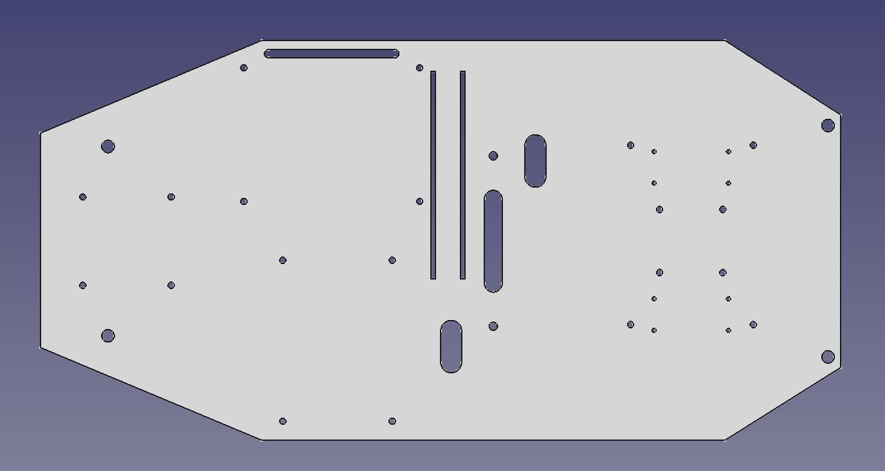
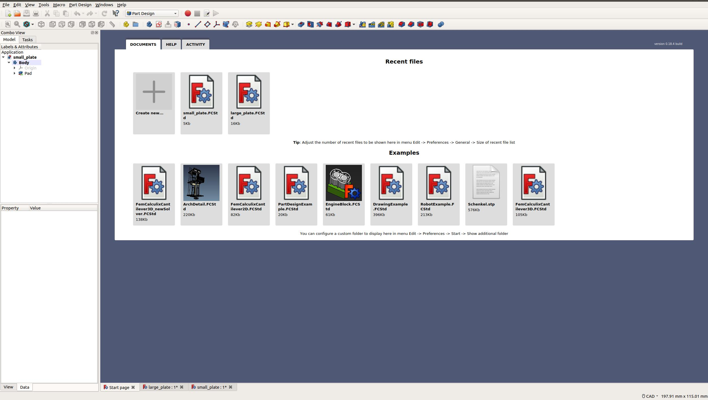
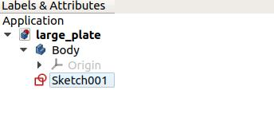
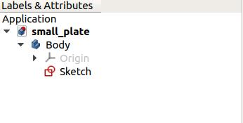
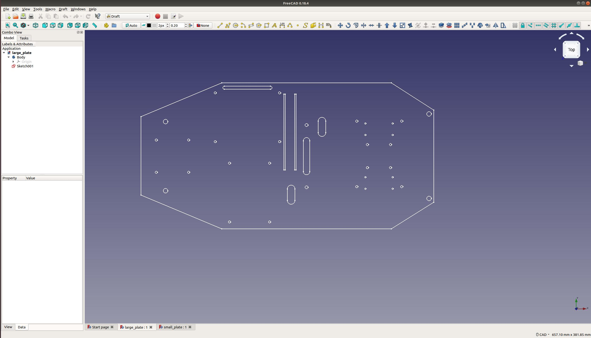
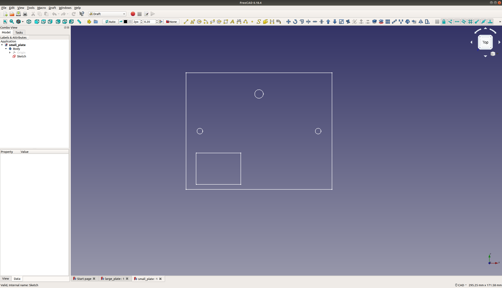
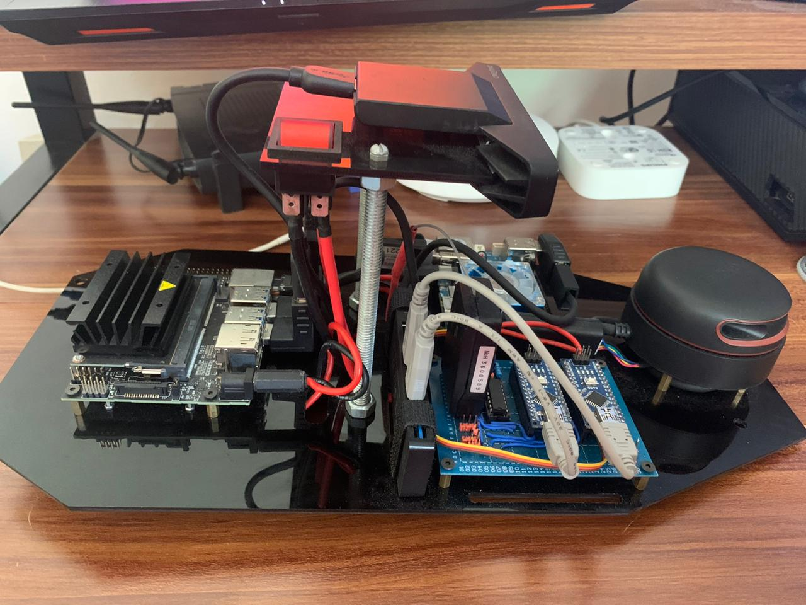
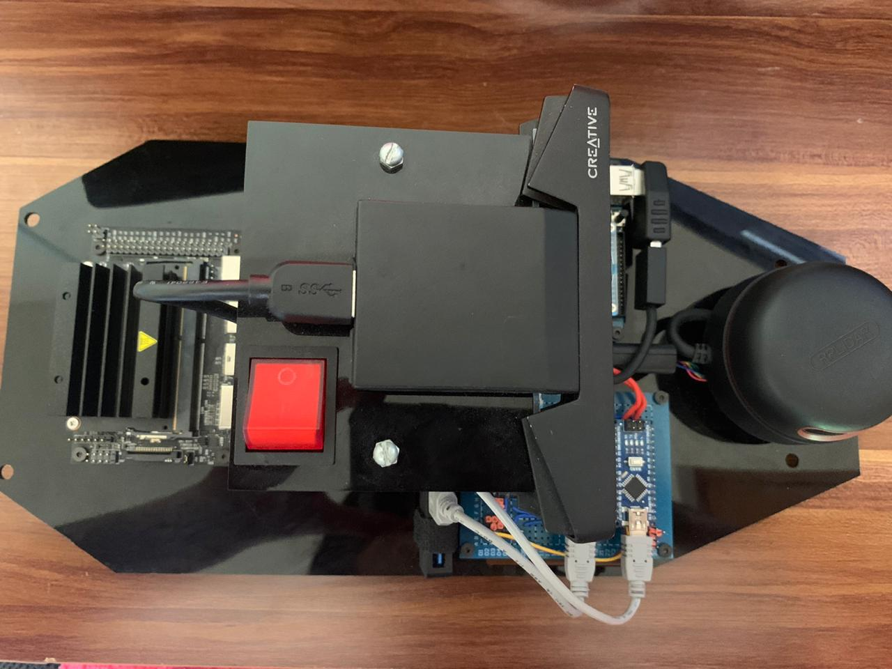
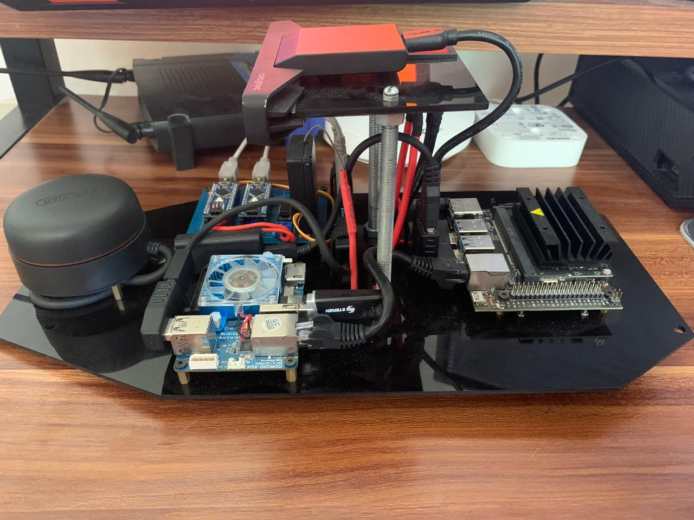

# Self Driving Car Project FreeCAD CAD Design
This directory includes the [Freecad](https://www.freecadweb.org/) **"large_plate"** and **"small_plate"** projects, used to design the Montage plates used to implement the desired hardware in the vehicle.   

| NOTE: The FreeCAD Suite was used for the development of this project based on its Open Source and Cross Platform Characteristics, allowing any user to have access and modify the provided resources for future updates or modifications. For more information on the FreeCAD Suite go [here](https://www.freecadweb.org/).  |
| --- |

  

## Table of Contents

* [Project Description](#project-description)
* [Installation](#installation)
  - [Software prerequisites](#software-prerequisites)
  - [Hardware prerequisites](#hardware-prerequisites)
  - [Software setup](#software-setup)
  - [Hardware setup](#hardware-setup)

## Project Description
The objective of this project is to develop the Self Driving Car montage plates, it includes the required sources to develop and modify this designs using the Open Source FreeCAD Software, including a general description of this project and the required prerequisites for its implementation.

## Installation
The following steps are aimed to help the user replicate the setting up of the project at its current state, as well as giving an overall understanding of the implemented system.

| NOTE: This tutorial serves as a guide to setup the project to run with the listed hardware and softwares specifications however it is recommended that any new contributor makes the effort of migrating the current state of the project to the newest software and hardware requisites as it will guarantee a longer support and the potential implementation of newer packages that might help push the project forward in the future.  |
| --- |

### Software Prerequisites
In order to open and make use of the **"large_plate"** and **"small_plate"** source files it'll be necessary to install the FreeCAD  Suite in your computer:
* Go to the [FreeCAD Downloads section](https://www.freecadweb.org/downloads.php) and select your Operating System.
* Follow the installation instructions for the FreeCAD Release.
* Search for the FreeCAD Application in your PC and open it.
* You'll se a window similar to:

  

* Go to the [large_plate project directory](large_plate) and open the **large_plate.FCTSd** file.
* You'll now see a tree view in the left menu box similar to:

  

* Go to the [small_plate project directory](small_plate) and open the **small_plate.FCTSd** file.
* You'll now see a tree view in the left menu box similar to:

  

### Hardware Prerequisites
* Acrylic Sheet 3mm thick
* 3mm, 2mm, 4mm Screws.
* 3mm, 2mm, 4mm Nuts.
* 3mm, 2mm , 4mm Spacers.

### Software Setup
The **"large_plate"** and **"small_plate"** FreeCAD Projects include the design resources used for the creation of the Self Driving Car Project Hardware Montage. The directories includes three files: **large_plate.FCStd"**, **small_plate.FCStd"**, **"large_plate_downgraded.FCStd"**, **"small_plate_downgraded.FCStd"** and **"larg_plate.dxf"**, **"small_plate.dxf"** files. _(Follow the instructions included in the [Installation](#installation) section in order to open the large_plate project, here you will find the mentioned design files)_

The **large_plate.FCStd** and **small_plate.FCStd** files include the main design of the Hardware montage plates used in the project. You can observe and modify the design by accessing the Sketch file.

In general, the Autodesk's DXF file format is frequently used for any laser cutting procedure, having to load the CAD file into the used device por the design manufacturing. In this project, the hardware moun plates where produced using a laser cutter in order to cut the desired patterns into the acrylic sheet, however it was necessary to export the design files to the mentioned format. FreeCAD allows to create this DXF Files from any design however it's first necessary to downgrade the design into simplest forms and edges in order to achieve a reliable DXF exporting. TO achieve this it's necessary to make a Drat Downgrade of the main CAD File.

The **large_plate_downgraded.FCStd** and **small_plate_downgraded.FCStd** files include the mentioned Draft Downgraded representation of the generated CAD files used to export the desired DXF Files. Finally the **large_plate.dxf** and **small_plate.dxf** are the AutoDesk's DXF format files used to load into the laser cutter to the final generation of the desired plates.

  

  

### Hardware Setup
The hardware setup is really straightforward, it will be necessary to upload the generated DXF files to the laser cutter and generate the desired plates, then mount each hardware component with the required screws, nuts and spacers.

  

  

  

