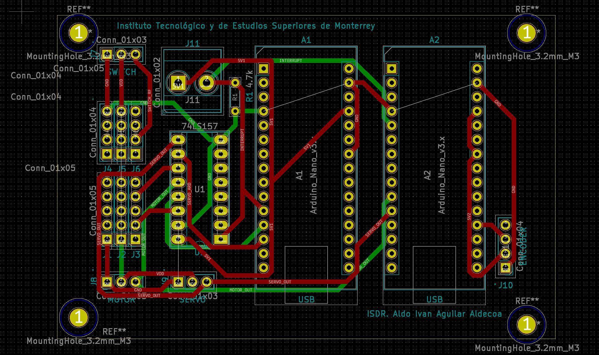

# Self Driving Car Project KiCad PCB Design
This directory includes the [KiCad](https://www.kicad-pcb.org/) **"pcb"** project, used to design the Direction and Speed Controller PCB implemented in the Self Driving Car Project.   

| NOTE: The KiCad EDA Suite was used for the development of this project based on its Open Source and Cross Platform Characteristics, allowing any user to have access and modify the provided resources for future updates or modifications. For more information on the KiCad EDA Suite go [here](https://www.kicad-pcb.org/).  |
| --- |

  

## Table of Contents

* [Project Description](#project-description)

* [Installation](#installation)

  - [Software prerequisites](#software-prerequisites)

  - [Hardware prerequisites](#hardware-prerequisites)

  - [Software setup](#software-setup)
  
  - [Hardware setup](#hardware-setup)

## Project Description
The objective of this project is to develop the Self Driving Car Direction and Speed Controller PCB, it includes the required sources to develop and modify this board using the Open Source KiCad EDA Software, including a general description of this project and the required prerequisites for its implementation.

## Installation
The following steps are aimed to help the user replicate the setting up of the project at its current state, as well as giving an overall understanding of the implemented system.

| NOTE: This tutorial serves as a guide to setup the project to run with the listed hardware and softwares specifications however it is recommended that any new contributor makes the effort of migrating the current state of the project to the newest software and hardware requisites as it will guarantee a longer support and the potential implementation of newer packages that might help push the project forward in the future.  |
| --- |

### Software Prerequisites
In order to open and make use of the **"pcb"** source files it'll be necessary to install the KiCad EDA Suite in your computer:
* Go to the [KiCad EDA Download section](https://www.kicad-pcb.org/download/) and select your Operating System.
* Follow the installation instructions for KiCad's Stable Release.
* Search for the KiCad Application in your PC and open it.
* You'll se a window similar to:

  

* Go to the [pcb project directory](pcb) and open the **pc.pro** file.
* You'll now see a tree view in the left menu box similar to:

  

### Hardware Prerequisites
* [Arduino Nano](https://store.arduino.cc/usa/arduino-nano)
* [Dual Terminal Block](https://articulo.mercadolibre.com.mx/MLM-606057911-borneras-bornes-terminales-conexion-pcb-arduino-robotica-_JM?matt_tool=65873753&matt_word&gclid=Cj0KCQjwy6T1BRDXARIsAIqCTXpDgjaNT2CEy81dMAPUocUoDs2DkgAVtDDbl-tf0lpIVRkcGjDF6mAaAjMkEALw_wcB&quantity=1)
* [16 Pin IC Socket](https://articulo.mercadolibre.com.mx/MLM-747897431-base-socket-para-circuito-integrado-16-pines-pack-20-piezas-_JM?quantity=1#position=6&type=item&tracking_id=53bed74d-7c0d-4ee6-b2de-27034858cc5a)
* [74LS157 IC](https://articulo.mercadolibre.com.mx/MLM-719086073-10pzs-74ls157-74157-multiplexor-y-selector-de-datos-_JM?quantity=1#position=1&type=item&tracking_id=8baa4de1-5f68-43eb-a4a4-0d66c8946778)
* [Female Header Connectors](https://articulo.mercadolibre.com.mx/MLM-686462836-header-hembra-cuadrada-40-pines-254mm-mv-electronica-_JM?quantity=1#position=4&type=item&tracking_id=ec4faa2c-5fe0-4fe5-9e25-1ca4e9676792)
* [Male Header Connectors](https://articulo.mercadolibre.com.mx/MLM-686756465-header-macho-40-pines-254mm-1-pz-arduino-mv-electronica-_JM?quantity=1#reco_item_pos=1&reco_backend=machinalis-seller-items-pdp&reco_backend_type=low_level&reco_client=vip-seller_items-above&reco_id=c50f5536-5ffa-46cc-8689-cafcea0cb692)

### Software Setup
The **"pcb"** KiCad Project includes different source files required for the creation of the Self Driving Car Project Direction and Speed Controller PCB. The project is mainly conformed of four main design files: **pcb.sch**, **pcb.lib**, **pcb.net**, **pcb.kicad_pcb**.  _(Follow the instructions included in the [Installation](#installation) section in order to open the pcb project, here you will find the mentioned design files)_.

The **pcb.sch** file includes the PCB Schematic Sheet, in here you can find the electric connections and the components and conform the design. In general, the design is conformed of eleven Jumper Connectors, a 74LS157 IC and two Arduino Nano, where:

* **J1 to J6**: Correspond to the Radio Control Receiver Connectors which will handle the received Speed, Direction an Operation Mode Control Signals from the Radio Control Transmitter.
* **J7**: Corresponds to the RC ON/OFF Switch three line connector which will receive the Radio Control Operation Mode Signal.
* **J8**: Corresponds to the Car's Speed Motor three line connector which will receive the generated Speed Control Signal.
* **J9**: Corresponds to the Car's Directional Servo Motor three line connector which will receive the generated Direction Control Signal.
* **J10**: Corresponds to the Car's Speed Encoder four line connector which will receive the Encoder Output Signal.
* **J11**: Corresponds to the RC ON/OFF Switch two line output Terminal Connector.
* **74LS157**: Dual Multiplexer used to select the desired Direction and Speed Control signals, it receives the Radio Control and Arduino generated Control signals and used the received Operation Mode Control Signal (RC ON/OFF Switch Output) to select between the mentioned outputs.
* **Arduino Nano 1**: Generates the desired autonomous Direction and Speed Control Signals, it receives the desired Speed and Direction values via USB Connection with the Odroid Board. _(For more information regarding the Arduino Nano 1 functionality go [here](../../odroid/src))_.
* **Arduino Nano 2**: Gets the generated Direction and Speed Control Signals as well as the Encoder Output and transmits this information via USB Connection with the Odroid Board. _(For more information regarding the Arduino Nano 2 functionality go [here](../../odroid/src))_.

  

The **pcb.lib** file includes the Footprint library used by the project to assigned the desired Footprints to the used components in the Schematic Sheet.

The **pcb.net** file includes the Schematic mapping with the required PCB Footprints, allowing to assign a specific Footprint to each of the components added to the PCB Schematic Sheet.

The **pcb.kicad_pcb** includes the final PCB design, including the Component Footprints, Connections, etc. Here, you can find the representation for he Schematic Components with the assigned Footprints as assigned in the .net file.

  

### Hardware Setup
The hardware setup is really straightforward, in general it will be necessary to follow the PCB footprints and Labels. In particular the main consideration to be taken is that any header connector is marked with a **dot** that specifies the GND connector, which means that any cable that must be connected to these headers require to have its GND pin attached to de **dot** marked pin of the connector. Also look for the orientation of the Multiplexor IC which can be identified by its footprint, and in the case of the Arduino Nano, the orientation can be determined by the USB Label marking the side where the USB Mini B connector must be placed.

  

